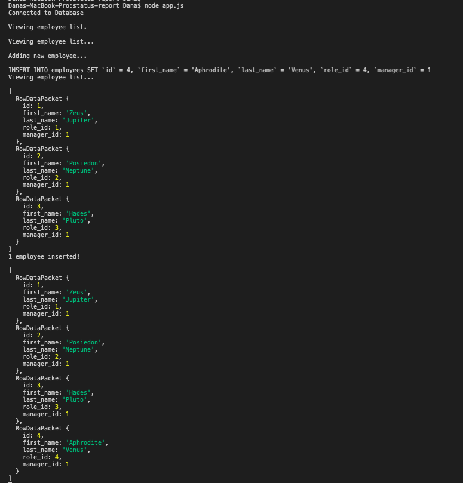
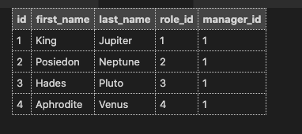

# Status Report

## Description

This is the twelfth assigment from the UConn Coding Boot Camp curriculum. We have covered the following topics thus far: Git, Terminal, GitHub, GitHub Pages, Web Accessibility, HTML, CSS, JavaScript, jQuery, Bootstrap, DOM Traversal, Web APIs, Third-Party APIs, Server-Side APIs, Node.js, Inquirer.js, and Express.js.

This assigment utilizes [MySQL](https://www.npmjs.com/package/mysql), node, and the [Inquirer package](https://www.npmjs.com/package/inquirer).

View the application [here](https://youtu.be/-S6agP5CkMM)

## Table of Contents

- [Goals](#goals)
- [Definitions](#definitions)
- [Instructions](#instructions)
- [User Story](#user-story)
- [Acceptance Criteria](#acceptance-criteria)
- [Installation](#installation)
- [Video](#video)
- [Usage](#usage)
- [Credits](#credits)
- [License](#license)

## Goals

1. To create a command-line application that allows users to:

   - Add departments, roles, employees

   - View departments, roles, employees

   - Update employee roles

2. Use the following tools and technologies:

   - [MySQL](https://www.npmjs.com/package/mysql) NPM package to connect to your MySQL database and perform queries.

   - [InquirerJs](https://www.npmjs.com/package/inquirer/v/0.2.3) NPM package to interact with the user via the command-line (collect user input).

   - [console.table](https://www.npmjs.com/package/console.table) to print MySQL rows to the console. There is a built-in version of `console.table`, but the NPM package formats the data a little better for our purposes.

   - (Optional) You may wish to have a separate file containing functions for performing specific SQL queries you'll need to use. Could a constructor function or a class be helpful for organizing these?

   - To perform a variety of SQL JOINS to complete this assignment - review class activities as needed.
   <!-- , and it's recommended you review the week's activities if you need a refresher on this. -->

   <!-- * `fs` for writing to the file system
   * Promises for handling asynchronous behavior -->

<!-- 3. Invoke the application by using the following command: `node server.js` -->

3. Focus on getting the basic functionality completed before working on more advanced features.

4. (Recommended) Include a `seed.sql` file to pre-populate your database. This will make development of individual features much easier.

5. Use Screencastify and provide a link to a walkthrough video that demonstrates its functionality.

### Definitions

The goals above and the application can be further understood with the following definitions:

**node.js**
: an implementation of the V8 JavaScript engine without Chrome. It allows you to write server-side code using JavaScript. This means that you no longer need a browser to run JavaScript. You can do so from the command line. Node.js ships with a **standard library**.

**schema**
: a file

**.sql file**
: a file to write MySQL

**inquirer**
: an npm package that provides an easy way to capture user input in your `node.js` command-line interface applications. It provides several methods for asking questions and returning answers from the user that can be accessed by a `.then` promise function.

## Instructions

Design the following database schema containing three tables:


- **department**:

  - **id** - INT PRIMARY KEY
  - **name** - VARCHAR(30) to hold department name

- **role**:

  - **id** - INT PRIMARY KEY
  - **title** - VARCHAR(30) to hold role title
  - **salary** - DECIMAL to hold role salary
  - **department_id** - INT to hold reference to department role belongs to

- **employee**:

  - **id** - INT PRIMARY KEY
  - **first_name** - VARCHAR(30) to hold employee first name
  - **last_name** - VARCHAR(30) to hold employee last name
  - **role_id** - INT to hold reference to role employee has
  - **manager_id** - INT to hold reference to another employee that manages the employee being Created. This field may be null if the employee has no manager

Build a command-line application that at a minimum allows the user to:

- Add departments, roles, employees

- View departments, roles, employees

- Update employee roles

Bonus points if you're able to:

- Update employee managers

- View employees by manager

- Delete departments, roles, and employees

- View the total utilized budget of a department -- ie the combined salaries of all employees in that department

### User Story

```
As a business owner
I want to be able to view and manage the departments, roles, and employees in my company
So that I can organize and plan my business

```

### Acceptance Criteria

The application must meet the following requirements:

```
GIVEN a command-line application that accepts user input
WHEN I am prompted to add a department, role, or employee
THEN I am able to add a department, role, or employee
WHEN I view the departments, roles, and employees
THEN this is displayed within a table -----
WHEN I update an employee's role
THEN this information is added to the employee's information
```

## Installation

-------Steps required to create Employee Tables:

1. Create a new repository.
   - Open GitHub and create new repository.
   - do NOT add a README.md file upon creation (that would defeat the purpose!).
2. Create a new directory to house new repo on your local computer.
   - Open Terminal (if MacOS), create a new directory using `mkdir project-name`
   - Make sure you are in the _root file_ of your local repository before you create any files.
3. Clone your GitHub repository to your local computer (make sure you are in the root folder of your new directory)
   ```
   git clone ssh-key-from-repository
   ```
4. Create a .gitignore file:

   - type `node_modules` in first line
   - type `.DS_Store` in second line

5. Create a new **package.json** file:

   - Initialize `npm`: `npm init`. This will be used to set up a new or existing npm package. You can customize the fields, or you can continue to press the enter key until you see `0 vulnerabilities`.
   - This will create a `package.json` file and a `package-lock.json` file.
   - Install the Inquirer package using: `npm install inquirer`
   - This will create a `node_modules` file.
   - You are now ready to create your `index.js` file: `touch server.js`

6. Set up Inquirer package within your newly created `server.js` file.

```
const inquirer = require('inquirer');
const fs = require("fs");
const util = require("util");
```

7. Copy and paste the code (or fork it) from the `server.js` within this repository.

8. Save file. Run `server.js` file within terminal using `node server.js`

9. If working, answer the prompts by entering your own inputs via the command line.

## Usage

Enter your inputs via the command-line:





## Credits

Reference articles:

- ["How to use the Inquirer Node package"](https://www.educative.io/edpresso/how-to-use-the-inquirer-node-package)
- ["The Node.js fs module"](https://nodejs.dev/learn/the-nodejs-fs-module)
- ["Promise"](https://developer.mozilla.org/en-US/docs/Web/JavaScript/Reference/Global_Objects/Promise)
- ["Install MySQL"](https://www.npmjs.com/package/mysql#install)

## License

[MIT](MITLicense.txt)

---

© 2020 Trilogy Education Services, LLC, a 2U, Inc. brand. Confidential and Proprietary. All Rights Reserved.
